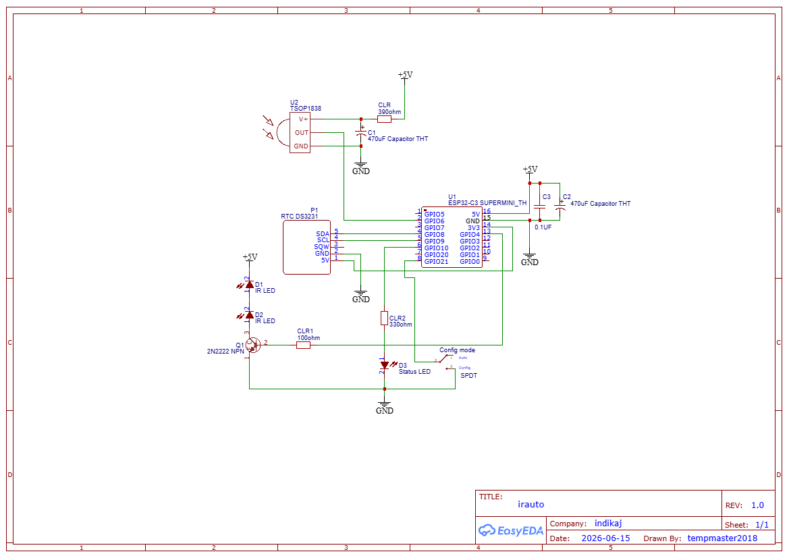
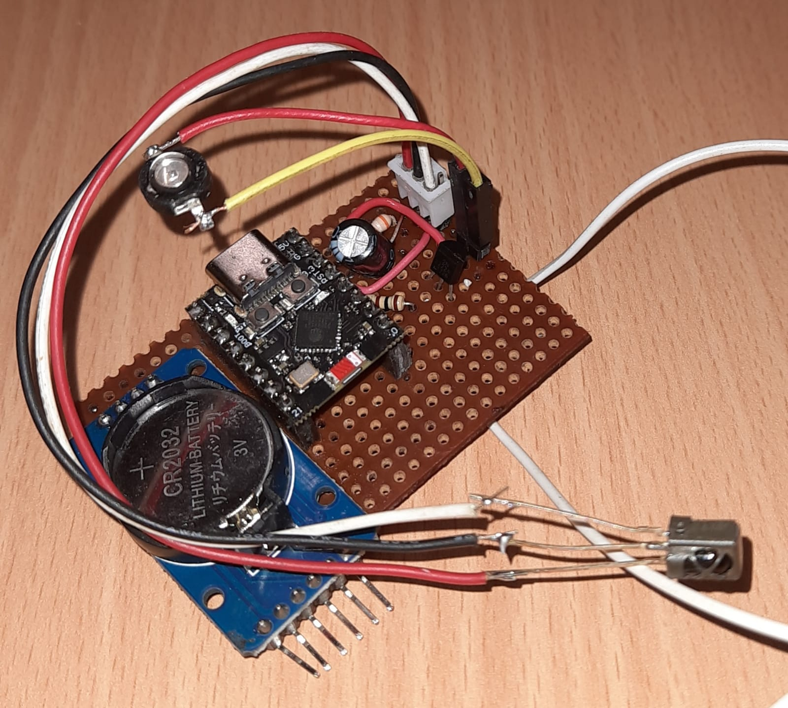
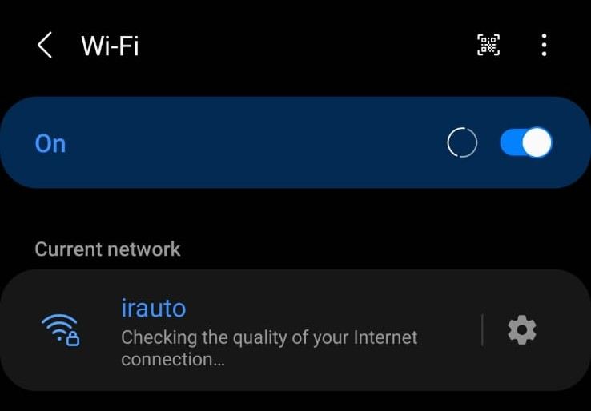
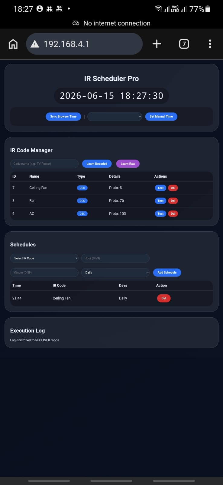

# IR Scheduler

IR Scheduler is an autonomous, web-enabled Infrared (IR) remote scheduler built for the ESP32-C3 Super Mini. This device allows you to learn IR codes (both RAW and decoded), schedule them to transmit at specific times, and toggle between a configuration mode and an autonomous execution mode using a physical switch. 

Accurate timekeeping is maintained using a DS3231 RTC, ensuring scheduled events fire reliably even without an active internet connection.

## Features
* **Dual Modes (Hardware Toggled):** 
  * **Receiver Mode (AP):** Broadcasts a Wi-Fi Access Point (`irauto`). Hosts an interactive web UI to capture IR codes, sync the RTC, and manage schedules.
  * **Auto Mode:** Disables Wi-Fi to save power and operates autonomously, executing scheduled IR signals based on the RTC.
* **Advanced IR Learning:** Supports learning and transmitting both standard decoded protocols and RAW IR signals.
* **Thermal Management:** Reduces the ESP_WiFi TX power to 40 (10dBm) to prevent thermal throttling and utilizes `vTaskDelay` to pass idle time back to FreeRTOS, keeping the CPU cool.
* **Persistent Storage:** Schedules and learned codes are saved to non-volatile flash memory using the `Preferences.h` library.

## Hardware Requirements
* **Microcontroller:** ESP32-C3 Super Mini
* **RTC Module:** DS3231
* **IR Hardware:** Standard 38kHz IR Receiver and IR LED

## Pin Configuration
| Component | Pin | Note |
| :--- | :--- | :--- |
| IR Transmitter LED | `GPIO 4` | |
| IR Receiver | `GPIO 6` | |
| Mode Switch | `GPIO 21` | Pull to GND for Receiver Mode |
| Built-in LED | `GPIO 10` | Active LOW |
| I2C SDA (RTC) | `GPIO 8` | Remapped |
| I2C SCL (RTC) | `GPIO 9` | Remapped |

## Installation & Flashing
1. **Download the Code:** Click the green **Code** button at the top of this repository and select **Download ZIP**, then extract it.
2. **Open in Arduino IDE:** Rename the main code file to have an `.ino` extension (e.g., `irAuto.ino`) and open it in the Arduino IDE.
3. **Install Dependencies:** Go to **Sketch > Include Library > Manage Libraries** and install the following:
   * `IRremoteESP8266` (Provides `IRrecv.h`, `IRsend.h`, `IRutils.h`)
   * `RTClib` (For the DS3231)
   * `ArduinoJson`
4. **Board Settings:** Select **ESP32C3 Dev Module** from the boards menu. Ensure "USB CDC On Boot" is enabled if you need serial monitor debugging.
5. **Upload:** Connect your ESP32-C3 Super Mini and click upload.

## Usage Instructions
1. **Initial Setup:** Wire the components according to the pinout table above.
2. **Configuration:** Flip the mode switch to **Receiver Mode** (pull GPIO 21 to GND). Power on the device and connect your phone or computer to the Wi-Fi AP:
   * **SSID:** `irauto`
   * **Password:** `12345678`
3. **Web UI:** Open a browser and navigate to the gateway IP (usually `192.168.4.1`). Use the interface to sync the browser's time to the RTC, learn your remote's IR codes, and set up your daily schedules.
4. **Execution:** Flip the switch back to **Auto Mode**. The ESP32 will disconnect from Wi-Fi, run cool, and automatically execute your IR schedules.

## Schematic

  

## Hardware

  

## WiFi-SSID

  

## Web Page

  

